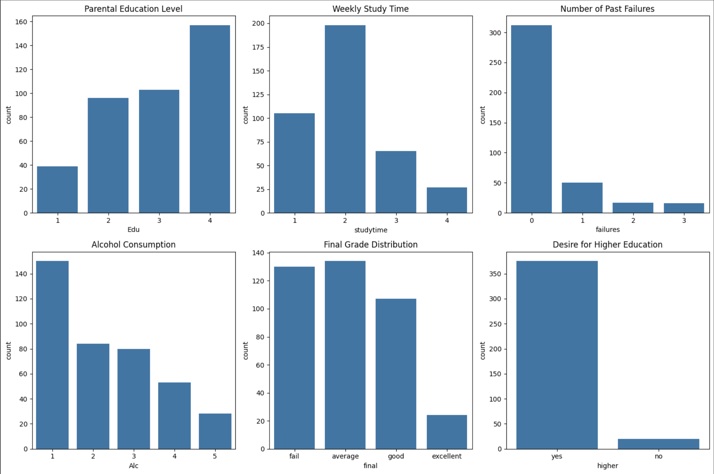
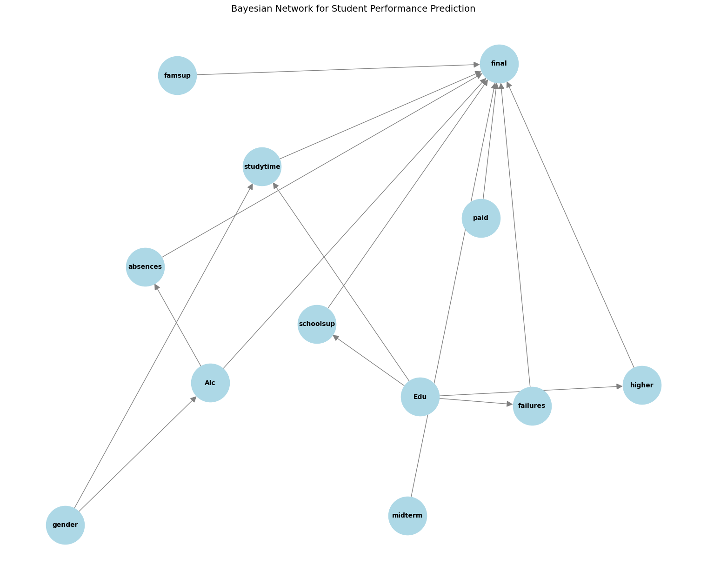

# Student Math Performance Analysis Using Bayesian Networks
*Duke Kunshan University STATS 202 HW5*

## 📖 Overview
This project investigates factors influencing high school students' mathematics performance using Bayesian networks. The analysis leverages the `pgmpy` library to model relationships between parental education, study habits, alcohol consumption, midterm performance, and final grades.

  

  <em>Figure 1: Final Grade Distribution.</em>

## Visualization of the Bayesian network structure

  

  <em>Figure 2: Baye's Network.</em>

## 🔑 Key Findings
### 1. Academic Momentum
| Midterm Grade | Failure Rate | Good Grade Probability |
|---------------|--------------|--------------------------|
| Fail          | 41.8%        | 15.8%                    |
| Good          | 14.4%        | 46.5%                    |

### 2. Parental Influence
| Parental Education | Failure Rate | Good Grade Probability |
|---------------------|--------------|------------------------|
| Low (Edu=0)         | 27.7%        | 26.1%                  |
| High (Edu=4)        | 26.7%        | 28.5%                  |

### 3. Behavioral Paradoxes
| Alcohol Consumption| Failure Rate | Good Grade Probability |
|--------------------|--------------|------------------------|
| Low (Alo=1)        | 30.7%        | 15.6%                  |
| High (Alo=5)       | 23.3%        | 21.3%                  |

### 4. Gender Neutrality
| Gender | Failure Rate | Good Grade Probability |
|-----------|--------------|------------------------|
| Femal     | 27.4%        | 27.8%                  |
| Mal       | 26.5%        | 27.5%                  |

